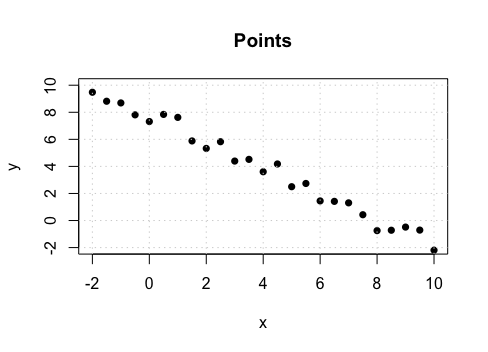

```{r global_options, include = FALSE}
library(knitr)
library(openintro)
library(tidyverse)
knitr::opts_chunk$set(eval = TRUE, results = TRUE)
```

### Instructions

+ This is the take home final due on Friday, December 15th, at 5:00 pm.

+ There are 30 possible points on this assignment.

+ This should take you approximately 3 hours to complete. You may work on the exam at various points between now and the due date. 

+ **Rules:**

  - You are allowed to use any course materials on this final. This includes the course texts, previous worksheets, and previous labs.

  - You should not be using google or any other website at any point during this exam. 
  - If you are having trouble using `R` (graphing, for example), look through old worksheets and labs for example code. You will not be asked to do anything in `R` that you have not done before. (If you really need to, you can google how to do something in `R`, but that is the only time you are permitted to use outside resources)
  - You are not permitted to speak with any one other than me about the midterm till after the due date. (Even if you finish early, don't talk to your class mates about it since they might not be finished).

+ Answer `R` questions by writing code where you are asked to `## insert code here`
+ Answer written questions in the space provided where it says "Write your answer here".
+ Written answers need to be in complete sentences. 
+ **You need to show your work or `R` code for any calculations.**


#### How to **submit** this assignment.

* When you are finished, click the "Knit" button at the top of this panel. If there are no errors, an HTML file should pop up after a few seconds.

* Take a look at the resulting HTML file that pops up. Make sure everything looks correct, your name is listed at the top, and that there is no 'junk' code or output. 

* Save the HTML file (to your local computer) as: **lastname_final**.

* Upload your HTML file to Moodle. **Do not** upload the original .Rmd version. 


---

### In many of the questions you can either use R code or work it out by hand. If you use R code make sure that I can see your final answer in the html document once it has been knitted. If you work it out by hand, make sure you show work to justify your answer.

##### **Exercise 1. Consider a data set consisting of four data points $\{1,4,8,13 \}$. Find the standard deviation. (1 point)**

```{r}
# insert code here if needed
```

<div>
:::{#answer}

Provide written answers here and include any work if needed.

:::


---

##### **Exercise 2. A national standardized test has an average score of $1200$ and standard deviation of $150$. If a student has a Z-score of $1.3$, what is their score on the test? (1 point)**

```{r}
# insert code here if needed
```

<div>
:::{#answer}

Provide written answers here and include any work if needed.

:::


---


##### **Exercise 3. The number of pets in homes in a randomly selected city is described by the probability distribution given below. What is the probability of a household having 4 or more pets? (1 point)**

| Number of Pets | Probability |
|:--: | :--:|
|$0$ | $.22$ |
|$1$ | $.32$ |
|$2$ | $.25$ |
|$3$ | $.08$ |
|$4+$ | ?? |

```{r}
# insert code here if needed
```

<div>
:::{#answer}

Provide written answers here and include any work if needed.

:::

---

##### **Exercise 4. A trading card brand sells cards in packs of $100$. There are three types of cards in each pack: attack, defense, and resource cards. The company claims that $45 \%$ of the cards are attackers, $35\%$ are defensive, and $20 \%$ are resource cards. Cards from each group are randomly assigned to packages. Suppose you bought a package of cards and counted the types from each group. What method would you use to test the claim that $45 \%$ of the cards are attackers, $35\%$ are defensive, and $20 \%$ are resource cards? (1 point)**

**a. Difference of Proportions** <br>
**b. Independence of Variables** <br>
**c. ANOVA** <br>
**d. Goodness of Fit** <br>
**e. Sample Proportion** <br>
**f. Sample Mean** <br>
**g. Difference of Sample Means** <br>


<div>
:::{#answer}

Answer here

:::
</div>


---

##### **Exercise 5. Consider the scatter plot shown below and answer the questions that follow:**

 


**(A.) Multiple choice: Which of the following could be the Pearson correlation coefficient between $x$ and $y$: (.5 point)**<br>
**a. $-.12$** <br>
**b. $.22$** <br>
**c. $-.84$** <br>
**d. $0$** <br>
**e. $.87$** <br>
**f. $-1$** <br>

**(B.) Given that the best fitting regression line has slope $-1.825$ and $y$-intercept $10$, predict $y$-value for the $x$-value $2.25$.(1 point)**

```{r}
# insert code here if needed
```

<div>
:::{#answer}

(A.) Provide written answers here and include any work if needed.

(B.) Provide written answers here and include any work if needed.

:::

---

##### **Exercise 6. The wingspan of bald eagles are normally distributed with a mean of $202.5$ cm and a standard deviation of $18.3$ cm. Find the probability that the mean wingspan for $15$ randomly selected eagles is greater than $208$ cm. (2 points)**

```{r}
# insert code here if needed
```

<div>
:::{#answer}

Provide written answers here and include any work if needed.

:::


---

##### **Exercise 7. Consider a drug used to treat hypertension. In clinical trials, among $3530$ patients treated with this drug, $90$ experienced nausea as a side effect. Use a $0.10$ significance level to test the claim that less than $3 \%$ of users develop nausea. (2.5 points)**

**(A.) Multiple choice: Which of the following best describes the type of data we are analyzing in this problem:**<br>
**a. Difference of Proportions** <br>
**b. Independence of Variables** <br>
**c. ANOVA** <br>
**d. Goodness of Fit** <br>
**e. Sample Proportion** <br>
**f. Sample Mean** <br>
**g. Difference of Sample Means** <br>

**(B.) What are the hypothesis for testing the claim?**

**(C.) Conduct a hypothesis test.**

**(D.) Based on the $p$-value found in part (C.), write the conclusion from your hypothesis test. Write your conclusion within the context of the problem.**

<div>
:::{#answer}

(A.) Write your answer here in a complete sentence

(B.) $H_0:$

$H_A:$

:::
</div>

```{r}
## insert code for (C.) here


```

<div>
:::{#answer}

(D.) Write your conclusion within the context of the problem here.

:::
</div>


---

##### **Exercise 8. Identify the type of data (categorical nominal, categorical ordinal, numeric discrete, or numeric continuous) that would be used to describe a response to the following: (2 points)**

(A.) percent body fat <br>
(B.) time spent watching ads on youtube in a day <br>
(C.) most listened to artist <br>
(D.) social security number <br>
(E.) amount of statistics learned, where the options are: (none), (some), (all of the stats)

<div>
:::{#answer}

(A.) answer here

(B.) answer here

(C.) answer here

(D.) answer here

(E.) answer here

:::
</div>


---


##### **Exercise 9. Load the `fastfood` data. (A.) Determine $b_0$, $b_1$, and $b_2$ for the best fitting multiple linear regression model for the calories of a fast food item as described by protein and sugar content. (B.) Based on your model, does protein content or sugar content have a larger effect on the total number of calories of a food item (Explain your reasoning)?  (2 points)**


```{r}
# insert code here if needed
```

<div>
:::{#answer}

(A.) Provide written answers here and include any work if needed.

(B.) Provide written answers here and include any work if needed.

:::
</div>

---

##### **Exercise 10. Burrowing owls sometimes line their nests with animal dung. One biologists conjectures that the owls may be trying to keep predators away. To test this theory, the biologist observed nests that were lined to see how often they were raided by predators. Before gathering any data, the biologist attributed the following probabilities to how often the nests would get raided: (2.5 points)**

| proportion of nests raided| 0 | .25 | .5 | .75 | 1 |
|:--:|:--:|:--:|:--:|:--:|:--:|
| prior probability of model | .1 | .35 | .35 | .15 | .05 |

##### **After observing $25$ nests, only $8$ of them were raided. Find the posterior probabilities of the models.**

```{r}
# insert code here if needed
```

<div>
:::{#answer}

Provide written answers here and include any work if needed.

:::

---

##### **Exercise 11. In a national poll of $600$ randomly sampled Americans consisting of $348$ men and $252$ women were asked if they felt valued at their jobs. The results found that $152$ men and $115 women felt valued at their jobs. Find a $90 \%$ confidence interval for the difference between the proportions of men and women that feel valued at their jobs. (2.5 points)**

**(A.) Multiple choice: Which of the following best describes the type of data we are analyzing in this problem:**<br>
**a. Difference of Proportions** <br>
**b. Independence of Variables** <br>
**c. ANOVA** <br>
**d. Goodness of Fit** <br>
**e. Sample Proportion** <br>
**f. Sample Mean** <br>
**g. Difference of Sample Means** <br>

**(B.) What are the hypothesis for testing the claim?**

**(C.) Conduct a hypothesis test.**

**(D.) Based on the $p$-value found in part (C.), write the conclusion from your hypothesis test. Write your conclusion within the context of the problem.**

<div>
:::{#answer}

(A.) Write your answer here in a complete sentence

(B.) $H_0:$

$H_A:$

:::
</div>

```{r}
## insert code for (C.) here


```

<div>
:::{#answer}

(D.) Write your conclusion within the context of the problem here.

:::
</div>


---

##### **Exercise 12. A doctor sees a sick child that either has measles or the flu. The doctor knows that $97 \%$ of sick children in that neighborhood have the flu, while the other $3 \%$ are sick with measles. A well-known symptom of measles is a rash. The probability of having a rash if one has measles is $0.95$. Occasionally children with the flu also develop rash, and the probability of having a rash if one has flu is $0.08$. Upon examining the child, the doctor finds a rash. What is the probability that the child has measles?**

```{r}
# insert code here if needed
```

<div>
:::{#answer}

Provide written answers here and include any work if needed.

:::

---

##### **Exercise 13. Suppose that $A$ and $B$ are events and $P(A)=.2$, $P(B)=.35$, and $P(A \text{ and } B)=.07$. Answer the following questions: (2 points)**

**(A.) Are events $A$ and $B$ independent, why or why not?**

**(B) Are events $A$ and $B$ disjoint, why or why not?**

**(C) Find $P(A|B)$.** 

**(D) Find $P(A \text{ or } B)$ **.


```{r}
# insert code here if needed
```

<div>
:::{#answer}

(A.) Provide written answers here and include any work if needed.

(B.) Provide written answers here and include any work if needed.

(C.) Provide written answers here and include any work if needed.

(D.) Provide written answers here and include any work if needed.

:::

---

##### **Exercise 14. Kyle commutes to work on a bike, so he goes for a bike ride about $70 \%$ of days. He also likes to run and goes for a run $40 \%$ of days. The probability that Kyle goes for a run on a day that he already went on a bike ride is $25 \%$. On a random day, what is the probability that Kyle (A.) both rode his bike and went on a run. (B.) either rode his bike or went on a run. (2 points)**

```{r}
# insert code here if needed
```

<div>
:::{#answer}

(A.) Provide written answers here and include any work if needed.

(B.) Provide written answers here and include any work if needed.

:::

---

##### **Exercise 15. Suppose you wanted to test if certain teams in the NBA are better 3-point shooting teams. To do this, you want to compare the average 3-point percentage for the teams in the NBA and see if there is a statistically significant difference. (1 point)**

**Multiple choice: What sort of statistical analysis might you do?**<br>
**a. Difference of Proportions** <br>
**b. Independence of Variables** <br>
**c. ANOVA** <br>
**d. Goodness of Fit** <br>
**e. Sample Proportion** <br>
**f. Sample Mean** <br>
**g. Difference of Sample Means** <br>

<div>
:::{#answer}

Provide written answers here and include any work if needed.

:::

---

##### **Exercise 16. Students at a university were polled about whether they live on campus or off campus. A two-way table separating the students by grade and by living arrangement is shown below. Do these data provide evidence to suggest that living situation depends on grade level? (2.5 points)**


| | On Campus | Off Campus | Total |
|:--:|:--:|:--:|:--:|
| First Year | $200$ | $85$ | $285$ |
| Sophomore | $102$ | $50$ | $152$ |
|Junior  | $50$ |  $93$ | $143$ |
|Senior  | $38$ | $32$ | $70$ |
| Totals: | $390$ | $260$ | $650$ |

**(A.) Multiple choice: Which of the following best describes the type of data we are analyzing in this problem:**<br>
**a. Difference of Proportions** <br>
**b. Independence of Variables** <br>
**c. ANOVA** <br>
**d. Goodness of Fit** <br>
**e. Sample Proportion** <br>
**f. Sample Mean** <br>
**g. Difference of Sample Means** <br>

**(B.) What are the hypothesis for testing the claim?**

**(C.) Conduct a hypothesis test.**

**(D.) Based on the $p$-value found in part (C.), write the conclusion from your hypothesis test. Write your conclusion within the context of the problem.**

<div>
:::{#answer}

(A.) Write your answer here in a complete sentence

(B.) $H_0:$

$H_A:$

:::
</div>

```{r}
## insert code for (C.) here

```

<div>
:::{#answer}

(D.) Write your conclusion within the context of the problem here.

:::
</div>


---

##### **Exercise 17. You buy a lottery ticket to a lottery that costs $\$10$ per ticket. There are only $100$ tickets available to be sold in this lottery. In this lottery there is one $\$500$ prize, two $\$100$ prizes, and four $\$25$ prizes. Find your expected gain or loss. (1.5 points)**

```{r}
# insert code here if needed
```

<div>
:::{#answer}

Provide written answers here and include any work if needed.

:::


